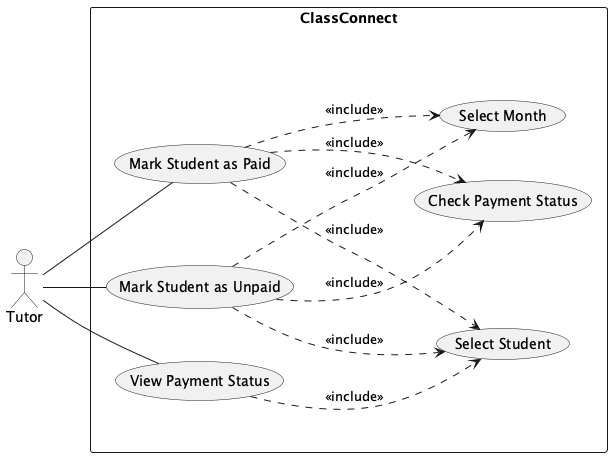
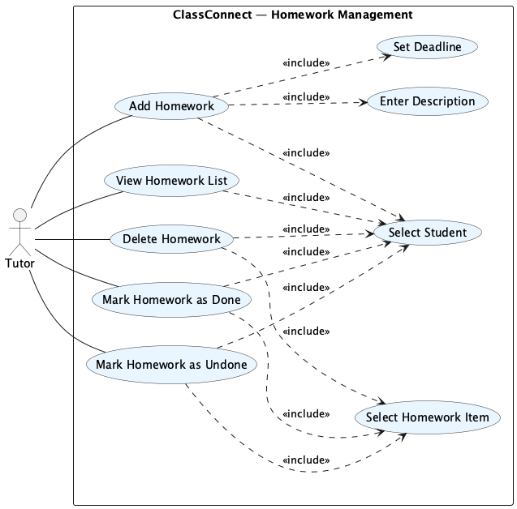

# ClassConnect Developer Guide

<!-- * Table of Contents -->
<page-nav-print />

--------------------------------------------------------------------------------------------------------------------

## **Acknowledgements**

This project builds upon the [se-edu AddressBook Level 3](https://se-education.org/addressbook-level3) codebase created by the [SE-EDU initiative](https://se-education.org) and adapts it for the NUS CS2103T team project.

--------------------------------------------------------------------------------------------------------------------
## **Setting up, getting started**

Refer to the guide [_Setting up and getting started_](SettingUp.md).

--------------------------------------------------------------------------------------------------------------------

<div style="page-break-after: always;"></div>

--------------------------------------------------------------------------------------------------------------------

## **Design**

### Architecture

<puml src="diagrams/ArchitectureDiagram.puml" width="280" />

The ***Architecture Diagram*** given above explains the high-level design of the App.

Given below is a quick overview of main components and how they interact with each other.

**Main components of the architecture**

**`Main`** (consisting of classes [`Main`](https://github.com/se-edu/addressbook-level3/tree/master/src/main/java/seedu/address/Main.java) and [`MainApp`](https://github.com/se-edu/addressbook-level3/tree/master/src/main/java/seedu/address/MainApp.java)) is in charge of the app launch and shut down.
* At app launch, it initializes the other components in the correct sequence, and connects them up with each other.
* At shut down, it shuts down the other components and invokes cleanup methods where necessary.

The bulk of the app's work is done by the following four components:

* [**`UI`**](#ui-component): The UI of the App.
* [**`Logic`**](#logic-component): The command executor.
* [**`Model`**](#model-component): Holds the data of the App in memory.
* [**`Storage`**](#storage-component): Reads data from, and writes data to, the hard disk.

[**`Commons`**](#common-classes) represents a collection of classes used by multiple other components.

<div style="page-break-after: always;"></div>

--------------------------------------------------------------------------------------------------------------------

**How the architecture components interact with each other**

The *Sequence Diagram* below shows how the components interact with each other for the scenario where the user issues the command `delete-student i/1`.

<puml src="diagrams/ArchitectureSequenceDiagram.puml" width="574" />

Each of the four main components (also shown in the diagram above),

* defines its *API* in an `interface` with the same name as the Component.
* implements its functionality using a concrete `{Component Name}Manager` class (which follows the corresponding API `interface` mentioned in the previous point.

For example, the `Logic` component defines its API in the `Logic.java` interface and implements its functionality using the `LogicManager.java` class which follows the `Logic` interface. Other components interact with a given component through its interface rather than the concrete class (reason: to prevent outside component's being coupled to the implementation of a component), as illustrated in the (partial) class diagram below.

<puml src="diagrams/ComponentManagers.puml" width="300" />

The sections below give more details of each component.

<div style="page-break-after: always;"></div>

--------------------------------------------------------------------------------------------------------------------

### UI component

The **API** of this component is specified in [`Ui.java`](https://github.com/se-edu/addressbook-level3/tree/master/src/main/java/seedu/address/ui/Ui.java)

<puml src="diagrams/UiClassDiagram.puml" alt="Structure of the UI Component"/>

The UI consists of a `MainWindow` that is made up of parts e.g.`CommandBox`, `ResultDisplay`, `PersonListPanel`, `StatusBarFooter` etc. All these, including the `MainWindow`, inherit from the abstract `UiPart` class which captures the commonalities between classes that represent parts of the visible GUI.

The `UI` component uses the JavaFx UI framework. The layout of these UI parts are defined in matching `.fxml` files that are in the `src/main/resources/view` folder. For example, the layout of the [`MainWindow`](https://github.com/se-edu/addressbook-level3/tree/master/src/main/java/seedu/address/ui/MainWindow.java) is specified in [`MainWindow.fxml`](https://github.com/se-edu/addressbook-level3/tree/master/src/main/resources/view/MainWindow.fxml)

The `UI` component,

* executes user commands using the `Logic` component.
* listens for changes to `Model` data so that the UI can be updated with the modified data.
* keeps a reference to the `Logic` component, because the `UI` relies on the `Logic` to execute commands.
* depends on some classes in the `Model` component, as it displays `Person` object residing in the `Model`.

**Participation panel on Person cards**
- The 5-slot participation view is computed by `ParticipationViewModel.computeSlots(...)` (pure helper for easy testing) and rendered in `PersonCard`.
- Dates are shown on the top row (`MM-dd`), scores inside the boxes on the bottom row.
- When a date appears multiple times in history, only the latest score is displayed.

<div style="page-break-after: always;"></div>

--------------------------------------------------------------------------------------------------------------------

### Logic component

**API** : [`Logic.java`](https://github.com/se-edu/addressbook-level3/tree/master/src/main/java/seedu/address/logic/Logic.java)

Here's a (partial) class diagram of the `Logic` component:

<puml src="diagrams/LogicClassDiagram.puml" width="550"/>

The sequence diagram below illustrates the interactions within the `Logic` component, taking `execute("delete-student i/1")` API call as an example.

<puml src="diagrams/DeleteSequenceDiagram.puml" alt="Interactions Inside the Logic Component for the `delete-student i/1` Command" />

<div style="page-break-after: always;"></div>

--------------------------------------------------------------------------------------------------------------------

<box type="info" seamless>

**Note:** The lifeline for `DeleteCommandParser` should end at the destroy marker (X) but due to a limitation of PlantUML, the lifeline continues till the end of diagram.
</box>

How the `Logic` component works:

1. When `Logic` is called upon to execute a command, it is passed to an `AddressBookParser` object which in turn creates a parser that matches the command (e.g., `DeleteCommandParser`) and uses it to parse the command.
1. This results in a `Command` object (more precisely, an object of one of its subclasses e.g., `DeleteCommand`) which is executed by the `LogicManager`.
1. The command can communicate with the `Model` when it is executed (e.g. to delete a person).<br>
   Note that although this is shown as a single step in the diagram above (for simplicity), in the code it can take several interactions (between the command object and the `Model`) to achieve.
1. The result of the command execution is encapsulated as a `CommandResult` object which is returned back from `Logic`.

Here are the other classes in `Logic` (omitted from the class diagram above) that are used for parsing a user command:

<puml src="diagrams/ParserClasses.puml" width="600"/>

How the parsing works:
* When called upon to parse a user command, the `AddressBookParser` class creates an `XYZCommandParser` (`XYZ` is a placeholder for the specific command name e.g., `AddCommandParser`) which uses the other classes shown above to parse the user command and create a `XYZCommand` object (e.g., `AddCommand`) which the `AddressBookParser` returns back as a `Command` object.
* All `XYZCommandParser` classes (e.g., `AddCommandParser`, `DeleteCommandParser`, ...) inherit from the `Parser` interface so that they can be treated similarly where possible e.g, during testing.

**Participation command specifics**
- `ParticipationCommandParser` ensures `n/`, `d/`, `s/` each appear exactly once (no preamble).
- `ParticipationCommand` validates values, mutates the target `Person`’s `ParticipationHistory`,
  calls `model.setPerson(person, person)` to trigger persistence, updates `AttendanceIndex`,
  and returns a success message.

<div style="page-break-after: always;"></div>

--------------------------------------------------------------------------------------------------------------------

### Model component
**API** : [`Model.java`](https://github.com/se-edu/addressbook-level3/tree/master/src/main/java/seedu/address/model/Model.java)

<puml src="diagrams/ModelClassDiagram.puml" width="450" />


The `Model` component,

* stores the address book data i.e., all `Person` objects (which are contained in a `UniquePersonList` object).
* stores the currently 'selected' `Person` objects (e.g., results of a search query) as a separate _filtered_ list which is exposed to outsiders as an unmodifiable `ObservableList<Person>` that can be 'observed' e.g. the UI can be bound to this list so that the UI automatically updates when the data in the list change.
* stores a `UserPref` object that represents the user’s preferences. This is exposed to the outside as a `ReadOnlyUserPref` objects.
* does not depend on any of the other three components (as the `Model` represents data entities of the domain, they should make sense on their own without depending on other components)

<box type="info" seamless>

**Note:** An alternative (arguably, a more OOP) model is given below. It has a `Tag` list in the `AddressBook`, which `Person` references. This allows `AddressBook` to only require one `Tag` object per unique tag, instead of each `Person` needing their own `Tag` objects.<br>

<puml src="diagrams/BetterModelClassDiagram.puml" width="450" />

</box>

<div style="page-break-after: always;"></div>

--------------------------------------------------------------------------------------------------------------------

### Storage component

**API** : [`Storage.java`](https://github.com/se-edu/addressbook-level3/tree/master/src/main/java/seedu/address/storage/Storage.java)

<puml src="diagrams/StorageClassDiagram.puml" width="550" />

The `Storage` component,
* can save both address book data and user preference data in JSON format, and read them back into corresponding objects.
* inherits from both `AddressBookStorage` and `UserPrefStorage`, which means it can be treated as either one (if only the functionality of only one is needed).
* depends on some classes in the `Model` component (because the `Storage` component's job is to save/retrieve objects that belong to the `Model`)

**Participation persistence notes**
- Each `Person` now serializes a `participation` array (list of `{ date: "YYYY-MM-DD", score: 0..5 }`).
- Missing `participation` (legacy files) is treated as an empty history.
- Invalid rows (bad date/score) are ignored during load to keep the rest of the file usable.

### Common classes

Classes used by multiple components are in the `seedu.address.commons` package.

--------------------------------------------------------------------------------------------------------------------

<div style="page-break-after: always;"></div>

--------------------------------------------------------------------------------------------------------------------

## **Implementation**

This section describes some noteworthy details on how certain features are implemented.

### Grouping feature

The grouping feature lets you organize students into named groups and manage memberships with commands such as group-create, group-add, group-remove, and group-delete. This is useful for filtering by group (e.g., “Sec3”, “MorningClass”) and showing group badges on each student card.

Key ideas

* A Group has a GroupName and a set of Person members.

* Commands operate through the Model interface; storage lives in the AddressBook via a UniqueGroupList.

* UI reads memberships via a small bridge (UiGroupAccess) to render badges next to each name.

* UniqueGroupList ensures group name uniqueness and provides lookup/removal by GroupName.

* AddressBook owns both the UniqueGroupList and the group memberships (i.e., the set of members for each group). It exposes high-level operations: createGroup, deleteGroup, addMembers, removeMembers, getGroupsOf(Person), etc.

* Model defines the API used by commands; ModelManager delegates to AddressBook.

<puml src="diagrams/Grouping.puml" alt="Class Diagram for Grouping" />

<div style="page-break-after: always;"></div>

--------------------------------------------------------------------------------------------------------------------

### Grouping Command Behaviour
#### Create group 

* Step 1. User enters: group-create g/Group A. AddressBookParser#parseCommand() instantiates GroupCreateCommandParser and calls parse(...).

* Step 2. GroupCreateCommandParser#parse() validates the presence/uniqueness of g/, normalizes the raw name via GroupName.of(...), and returns a GroupCreateCommand.

<puml src="diagrams/GroupCreateSequenceDiagram.puml" />

* Step 3. GroupCreateCommand#execute(model) calls model.createGroup(name). If a duplicate exists, a CommandException is thrown. Otherwise a success CommandResult is returned.

<puml src="diagrams/GroupCreateCommandSequenceDiagram.puml" />

<div style="page-break-after: always;"></div>

--------------------------------------------------------------------------------------------------------------------

#### Add members to group

* Step 1. User enters: group-add g/Group A i/1 i/3. AddressBookParser invokes GroupAddCommandParser#parse(...).

* Step 2. Parser ensures exactly one g/ and ≥1 i/. It builds GroupName, parses Index list, and returns a GroupAddCommand.

<puml src="diagrams/GroupAddSequenceDiagram.puml" />

* Step 3. GroupAddCommand#execute(model) resolves the displayed persons by indices, validates that the group exists, and then calls model.addToGroup(name, members). If any index is invalid, a CommandException is thrown. On success, the filtered person list is refreshed (if needed) and a success CommandResult is returned.

<puml src="diagrams/GroupAddCommandSequenceDiagram.puml" />

<div style="page-break-after: always;"></div>

--------------------------------------------------------------------------------------------------------------------

#### Remove members from group

Parser and execution mirror group-add, except the model op is removeFromGroup(...). The command succeeds for valid indices; persons not in the group are skipped.

<puml src="diagrams/GroupRemoveSequenceDiagram.puml" /> <puml src="diagrams/GroupRemoveCommandSequenceDiagram.puml" />

<div style="page-break-after: always;"></div>

--------------------------------------------------------------------------------------------------------------------

#### Delete group

* Step 1. User enters: group-delete g/Group A. GroupDeleteCommandParser returns a GroupDeleteCommand with the parsed name.

* Step 2. GroupDeleteCommand#execute(model) calls model.deleteGroup(name), which also clears its memberships. If group is missing, a CommandException is thrown. Returns success CommandResult.

<puml src="diagrams/GroupDeleteSequenceDiagram.puml" /> <puml src="diagrams/GroupDeleteCommandSequenceDiagram.puml" />

#### Notes

- Normalization. GroupName.of(String) handles trimming, case-insensitivity, allowed characters, and collapsing whitespace so that logical duplicates are rejected.

- Persistence. JsonSerializableAddressBook reads/writes both the group list and memberships. JsonAdaptedGroup serializes { "name": "...", "members": [ ... ] }.

- UI badges. UiGroupAccess is installed by MainWindow#fillInnerParts() and maps Person → Set<GroupName> to render chips in PersonCard.

<div style="page-break-after: always;"></div>

--------------------------------------------------------------------------------------------------------------------

### Participation feature

<puml src="diagrams/ParticipationSequence.puml" width="720" />

The Participation feature lets tutors record a per-class participation score for a student and shows the **last 5 classes** (chronological, oldest → newest) on each student card, with the **date above** each box and the **score inside**.

#### Command format & validation
- Command: `participation n/NAME d/YYYY-MM-DD s/0..5`
- Validation:
  - `NAME` must be non-empty, ≤ 50 chars. Matching is case-insensitive after whitespace normalization.
  - `DATE` must be ISO `YYYY-MM-DD`.
  - `SCORE` must be an integer in `[0, 5]`.

#### Logic flow
- `ParticipationCommand`:
  1. Parses/validates inputs (parser enforces single occurrence of prefixes; command validates values).
  2. Finds `Person` by normalized name from `Model#getAddressBook().getPersonList()`.
  3. Appends a new `ParticipationRecord(date, score)` to `person.getParticipation()`.
  4. Calls `model.setPerson(person, person)` to trigger persistence/autosave.
  5. Updates the legacy `AttendanceIndex` current UI date and refreshes the filtered list.

#### Model
- `ParticipationRecord` — immutable `(LocalDate date, int score)`, score ∈ `[0,5]`.
- `ParticipationHistory` — keeps **up to 5 most recent** records by insertion order:
  - `add(record)` pushes to the tail; drops oldest if size > 5.
  - `asList()` returns oldest → newest; `mostRecent()` returns last or `null`.

#### UI (Person card)
- The 5-box panel is produced via a pure helper `ParticipationViewModel.computeSlots(history)`:
  - Returns exactly 5 slots (oldest → newest), padded at the front when fewer than 5 exist.
  - If multiple records share the **same date**, only the **latest** score is shown.
- Styling comes from `participation.css` (e.g., `.participation-box`, `.date-mini`).

<div style="page-break-after: always;"></div>

--------------------------------------------------------------------------------------------------------------------

#### Storage
- `JsonAdaptedPerson` persists a `participation` array:

```json
  "participation": [
    { "date": "2025-09-19", "score": 4 },
    { "date": "2025-09-21", "score": 2 }
  ]
````

* Older files without this field load as empty histories.
* Invalid rows (e.g., score out of range) are **skipped** during load so one bad row doesn’t corrupt the file.

* `Invalid student name: name cannot be empty.`
* `Invalid student name: no matching student found.`
* `Invalid date. The format must be YYYY-MM-DD.`
* `Invalid participation score. Use an integer 0 to 5.`
* `Invalid participation score. Must be between 0 and 5 inclusive.`

#### Design notes

* **5 entries** keeps the UI legible and makes updates O(1) amortized.
* **Same-date replacement** is handled in the view-model so tutors can overwrite a day’s score cleanly.
* Calling `model.setPerson(person, person)` ensures storage hooks run without changing other APIs.

### Reminder feature

The reminder subsystem manages time-based reminders: user-created reminders and generated unmodifiable reminders (homework and payment).

#### Key Ideas

There are 2 types of reminders: `Reminder` and `UnmodfiableReminder`.

* The concrete class `Reminder` is created and modified by the user va the add, edit, delete commands. It implements `Comparable<Reminder>` to allow sorting of reminders by their due date.
* The abstract subclass `UnmodifiableReminder` of `Reminder` is generated by the system and cannot be modified by the user. It has 2 subclasses that extends it:
  * `UnmodifiablePaymentReminder` tracks the payment status of every student that has yet to pay for the current month in the student list.
  * `UnmodifiableHwReminder` tracks the homework completion status of every student for assigned homework that has not been completed.

<puml src="diagrams/ReminderClassDiagram.puml" width="550"/>

<div style="page-break-after: always;"></div>

--------------------------------------------------------------------------------------------------------------------

#### Command Behaviour

##### Add reminder

Step 1: User runs the command `add-reminder d/2025-10-10 1200 desc/10.10 Sale!` to add a reminder. The input command string is passed to `AddressBookParser#parseCommand()` which creates an instance of `AddReminderCommandParser` and calls `AddReminderCommandParser#parse()` that parses the arguments `d/2025-10-10 1200 desc/10.10 Sale!`.

Step 2: `AddReminderCommandParser#parse()` checks if the prefix for due date and description are present and correct, and ensures that there is no duplication of prefixes. Next, values of each prefix is passed to `ParserUtil#parseDueDate` or `ParserUtil#parseReminderDescription` which creates an instance of `DueDate` or `Description`. The method then creates an instance of `Reminder` with the created instances of `DueDate` and `Description`, which is used to create an instance of `AddReminderCommand` that is returned.

<puml src="diagrams/AddReminderSequenceDiagram.puml" />

<box type="info" seamless>

**Note:** The lifeline for `AddReminderCommandParser` should end at the destroy marker (X) but due to a limitation of PlantUML, the lifeline continues till the end of diagram.

</box>

Step 3: `AddReminderCommand#execute()` is called, and adds the reminder to the reminder list. A success message is returned after a successful addition via an instance of `CommandResult`.

<box type="warning" seamless>

**Note:** If the current reminder list already contains a duplicate reminder as the reminder to add, the command would fail and a `CommandException` instance is thrown with a duplicate reminder message.

</box>

<puml src="diagrams/AddReminderCommandSequenceDiagram.puml" />

<div style="page-break-after: always;"></div>

--------------------------------------------------------------------------------------------------------------------

<box type="info" seamless>

**Note:** The lifeline for `AddReminderCommand` should end at the destroy marker (X) but due to a limitation of PlantUML, the lifeline continues till the end of diagram.

</box>

##### Edit reminder

Similar to add reminder command as above, except the following:

* The user runs the command `edit-reminder i/1 d/2025-11-11 desc/11.11 Sale!` to edit the 1st reminder in the displayed reminder list. Prefix `d/` and `desc/` are optional but at least one of them needs to be included in the command.

* In Step 2, `EditReminderCommandParser#parse()` creates an instance of `EditReminderDescriptor` to contain the fields that the user wants to edit. It checks that at least one field is to be edited, and creates an instance of `EditReminderCommand` with the index of the reminder to edit and `EditReminderDescriptor` which is then returned by the method.

<puml src="diagrams/EditReminderSequenceDiagram.puml" />

<box type="info" seamless>

**Note:** The lifeline for `EditReminderCommandParser` should end at the destroy marker (X) but due to a limitation of PlantUML, the lifeline continues till the end of diagram.

</box>

<div style="page-break-after: always;"></div>

--------------------------------------------------------------------------------------------------------------------

* In Step 3, the reminder to edit is copied and injected with the new fields. This new reminder is then set to replace the old reminder in the reminder list. After a successful edit, the reminder is list is updated to show all reminders and a success message is also returned via an instance of `CommandResult`.

<box type="warning" seamless>

**Note:**

* If the index provided is greater than the size of the displayed reminder list, the command would fail and a `CommandException` instance is thrown with an invalid index message.

* If the reminder to edit is an instance of `UnmodifiableReminder`, the command would fail and a `CommandException` instance is thrown with an unmodifiable reminder message.

</box>

<puml src="diagrams/EditReminderCommandSequenceDiagram.puml" />

<box type="info" seamless>

**Note:** The lifeline for `EditReminderCommand` should end at the destroy marker (X) but due to a limitation of PlantUML, the lifeline continues till the end of diagram.

</box>

<div style="page-break-after: always;"></div>

--------------------------------------------------------------------------------------------------------------------

##### Delete reminder

Similar to add reminder command as above, except the following:

* The user runs the command `delete-reminder i/1` to delete the 1st reminder from the displayed reminder list. This command also allows for deletion by keyword via `delete-reminder k/sale`, but prefix `i/` and `k/` cannot be used together in the same command.

* In Step 2, `DeleteReminderCommandParser#parse()` checks if only either of the prefixes is used. If deletion is done by index, `ParserUtil#parseIndex()` is called to parse the index value and returns an instance of `DeleteReminderCommand` with the index value. If deletion is done by keyword, an instance of `ReminderFieldsContainsKeywordsPredicate` is created to contain the list of keywords to delete by, which is used to create an instance of `DeleteReminderCommand` and then returned by the method.

<puml src="diagrams/DeleteReminderSequenceDiagram.puml" />

<box type="info" seamless>

**Note:** The lifeline for `DeleteReminderCommandParser` should end at the destroy marker (X) but due to a limitation of PlantUML, the lifeline continues till the end of diagram.

</box>

<div style="page-break-after: always;"></div>

--------------------------------------------------------------------------------------------------------------------

* In Step 3, if the deletion is by keyword, `DeleteReminderCommand#execute()` will search for all reminders in the list and successfully deletes if only one reminder is found. If no or multiple reminders are found, the command will still succeed but without any deletion. A message is returned via an instance of `CommandResult` indicating if no or multiple reminders are found.

<box type="warning" seamless>

**Note:**

* If the index provided is greater than the size of the displayed reminder list, the command would fail and a `CommandException` instance is thrown with an invalid index message.

* If the reminder to delete is an instance of `UnmodifiableReminder`, the command would fail and a `CommandException` instance is thrown with an unmodifiable reminder message.

</box>

<puml src="diagrams/DeleteReminderCommandSequenceDiagram.puml" />

<box type="info" seamless>

**Note:** The lifeline for `DeleteReminderCommand` should end at the destroy marker (X) but due to a limitation of PlantUML, the lifeline continues till the end of diagram.

</box>

<div style="page-break-after: always;"></div>

--------------------------------------------------------------------------------------------------------------------

<puml src="diagrams/DeleteReminderReferenceSequenceDiagram.puml"/>

### Delete student feature

This features deletes a student form the students list. This feature is facilitated by the `LogicManger`, `AddressBookParser`, `DeleteCommandParser`, `DeleteCommand`, `CommandResult` and `Model` classes. Given below is a high level overview of how a student is being deleted from the students list.

<puml src="diagrams/DeleteSequenceDiagram.puml" />

<div style="page-break-after: always;"></div>

--------------------------------------------------------------------------------------------------------------------

### Mark payment feature

The Payment Tracking feature allows tutors to mark and track monthly payment status for each student across a 12-month period. This feature provides both visual indicators in the UI and command-line operations for updating payment records.

Key ideas
* A `Person` stores payment status using a `BitSet` with 12 bits (one for each month).
* Payment status can be marked as paid or unpaid for any month (1-12, representing January to December).
* The command operates through the `Model` interface and updates the `Person` object in-place.
* The UI displays payment status under each student card with color-coded rectangles (green = paid, red = unpaid). 
* Validation prevents marking an already-paid month as paid again or an already-unpaid month as unpaid again.



The diagram above illustrates the **Payment Management** use cases in ClassConnect. Tutors can **mark students as paid or unpaid** for specific months and **view payment status** for all students.

- **Mark Student as Paid**: Updates a student's payment status to paid for a specified month.
- **Mark Student as Unpaid**: Updates a student's payment status to unpaid for a specified month.
- **View Payment Status**: Displays a 12-month payment grid for each student with visual indicators.

Each of these features interacts with the `paymentStatus` field stored within every `Person` object.

### Add Homework

The add-homework feature lets tutors record homework tasks for individual students. Each homework entry contains a **description**, **due date**, and completion status (default: not done).

**Key ideas**
- A `Homework` stores its description, due date, and done status.
- Each `Person` maintains a list of `Homework` objects.
- The command operates through the `Model` interface and updates storage via the `AddressBook`.
- The UI displays homework items under each student card, showing description, due date, and status badges.
- Duplicate entries (same description and date) are prevented.

<div style="page-break-after: always;"></div>

--------------------------------------------------------------------------------------------------------------------



The diagram above illustrates the **Homework Management** use cases in ClassConnect.  
Tutors can **add**, **view**, **delete**, and **mark homework as done or undone** for each student.

- **Add Homework**: Creates a new homework entry with a description and due date for a selected student.
- **Delete Homework**: Removes a homework entry from the student’s list when it is no longer needed.
- **Mark Homework as Done / Undone**: Updates the completion status of an existing homework task, helping tutors keep track of student progress.
- **View Homework List**: Displays all homework items for each student, including their deadlines and status badges.

Each of these features interacts with the same underlying `Homework` model and `HomeworkList` stored within every `Person` object.

<div style="page-break-after: always;"></div>

--------------------------------------------------------------------------------------------------------------------

### Search
<puml src="diagrams/SearchSequence.puml"/>

* The activity diagram above illustrates the flow of the search-student command.  
* When the tutor enters a search query (e.g., `search-student k/10:00`), the command parser extracts the keyword and creates a predicate that checks whether any student’s fields (such as name, phone number, lesson time, or subject) contain the keyword.  
* The model then updates its filtered student list based on this predicate.  
* If one or more matches are found, the system displays a success message showing the number of students found; otherwise, it shows a message indicating that no students match the search keyword.
 this the text

### \[Proposed\] Undo/redo feature

#### Proposed Implementation

The proposed undo/redo mechanism is facilitated by `VersionedAddressBook`. It extends `AddressBook` with an undo/redo history, stored internally as an `addressBookStateList` and `currentStatePointer`. Additionally, it implements the following operations:

* `VersionedAddressBook#commit()` — Saves the current address book state in its history.
* `VersionedAddressBook#undo()` — Restores the previous address book state from its history.
* `VersionedAddressBook#redo()` — Restores a previously undone address book state from its history.

These operations are exposed in the `Model` interface as `Model#commitAddressBook()`, `Model#undoAddressBook()` and `Model#redoAddressBook()` respectively.

Given below is an example usage scenario and how the undo/redo mechanism behaves at each step.

Step 1. The user launches the application for the first time. The `VersionedAddressBook` will be initialized with the initial address book state, and the `currentStatePointer` pointing to that single address book state.

<puml src="diagrams/UndoRedoState0.puml" alt="UndoRedoState0" />

<div style="page-break-after: always;"></div>

--------------------------------------------------------------------------------------------------------------------

Step 2. The user executes `delete 5` command to delete the 5th person in the address book. The `delete` command calls `Model#commitAddressBook()`, causing the modified state of the address book after the `delete 5` command executes to be saved in the `addressBookStateList`, and the `currentStatePointer` is shifted to the newly inserted address book state.

<puml src="diagrams/UndoRedoState1.puml" alt="UndoRedoState1" />

Step 3. The user executes `add n/David …​` to add a new person. The `add` command also calls `Model#commitAddressBook()`, causing another modified address book state to be saved into the `addressBookStateList`.

<puml src="diagrams/UndoRedoState2.puml" alt="UndoRedoState2" />

<box type="info" seamless>

**Note:** If a command fails its execution, it will not call `Model#commitAddressBook()`, so the address book state will not be saved into the `addressBookStateList`.

</box>

Step 4. The user now decides that adding the person was a mistake, and decides to undo that action by executing the `undo` command. The `undo` command will call `Model#undoAddressBook()`, which will shift the `currentStatePointer` once to the left, pointing it to the previous address book state, and restores the address book to that state.

<puml src="diagrams/UndoRedoState3.puml" alt="UndoRedoState3" />

<box type="info" seamless>

**Note:** If the `currentStatePointer` is at index 0, pointing to the initial AddressBook state, then there are no previous AddressBook states to restore. The `undo` command uses `Model#canUndoAddressBook()` to check if this is the case. If so, it will return an error to the user rather
than attempting to perform the undo.

</box>

<div style="page-break-after: always;"></div>

--------------------------------------------------------------------------------------------------------------------

The following sequence diagram shows how an undo operation goes through the `Logic` component:

<puml src="diagrams/UndoSequenceDiagram-Logic.puml" alt="UndoSequenceDiagram-Logic" />

<box type="info" seamless>

**Note:** The lifeline for `UndoCommand` should end at the destroy marker (X) but due to a limitation of PlantUML, the lifeline reaches the end of diagram.

</box>

Similarly, how an undo operation goes through the `Model` component is shown below:

<puml src="diagrams/UndoSequenceDiagram-Model.puml" alt="UndoSequenceDiagram-Model" />

The `redo` command does the opposite — it calls `Model#redoAddressBook()`, which shifts the `currentStatePointer` once to the right, pointing to the previously undone state, and restores the address book to that state.

<box type="info" seamless>

**Note:** If the `currentStatePointer` is at index `addressBookStateList.size() - 1`, pointing to the latest address book state, then there are no undone AddressBook states to restore. The `redo` command uses `Model#canRedoAddressBook()` to check if this is the case. If so, it will return an error to the user rather than attempting to perform the redo.

</box>

Step 5. The user then decides to execute the command `list`. Commands that do not modify the address book, such as `list`, will usually not call `Model#commitAddressBook()`, `Model#undoAddressBook()` or `Model#redoAddressBook()`. Thus, the `addressBookStateList` remains unchanged.

<puml src="diagrams/UndoRedoState4.puml" alt="UndoRedoState4" />

<div style="page-break-after: always;"></div>

--------------------------------------------------------------------------------------------------------------------

Step 6. The user executes `clear`, which calls `Model#commitAddressBook()`. Since the `currentStatePointer` is not pointing at the end of the `addressBookStateList`, all address book states after the `currentStatePointer` will be purged. Reason: It no longer makes sense to redo the `add n/David …​` command. This is the behavior that most modern desktop applications follow.

<puml src="diagrams/UndoRedoState5.puml" alt="UndoRedoState5" />

The following activity diagram summarizes what happens when a user executes a new command:

<puml src="diagrams/CommitActivityDiagram.puml" width="250" />

#### Design considerations:

**Aspect: How undo & redo executes:**

* **Alternative 1 (current choice):** Saves the entire address book.

  * Pros: Easy to implement.
  * Cons: May have performance issues in terms of memory usage.

* **Alternative 2:** Individual command knows how to undo/redo by
  itself.

  * Pros: Will use less memory (e.g. for `delete`, just save the person being deleted).
  * Cons: We must ensure that the implementation of each individual command are correct.

*{more aspects and alternatives to be added}*

### [Proposed] Data archiving

*{Explain here how the data archiving feature will be implemented}*

---

<div style="page-break-after: always;"></div>

--------------------------------------------------------------------------------------------------------------------

## **Documentation, logging, testing, configuration, dev-ops**

* [Documentation guide](Documentation.md)
* [Testing guide](Testing.md)
* [Logging guide](Logging.md)
* [Configuration guide](Configuration.md)
* [DevOps guide](DevOps.md)

The Participation feature includes unit tests for command validation, model capping/mostRecent, UI view-model
(chronological + same-date dedup + padding), and storage round-trip (including invalid-row skipping).

---

## Appendix: Requirements

### Product scope

**Target user profile**:

* Private tutors managing ~20–40 students individually.
* Need to keep track of **student + parent contact details, lesson times, homework, payments, and performance notes**.
* Prefer **fast, keyboard-driven CLI apps** over complex GUIs.
* Comfortable with basic computer operations, but want **lightweight, no-frills software**.

**Value proposition**: ClassConnect allows tutors to manage lessons, admin tasks, and student progress **faster and more accurately** than traditional notebooks or bloated management systems.

---

### User stories

Priorities: High (must have) - `* * *`, Medium (nice to have) - `* *`, Low (unlikely to have) - `*`

| Priority | As a …​  | I want to …​                            | So that I can…​                                   |
|----------|----------|-----------------------------------------|---------------------------------------------------|
| `* * *`  | tutor    | add a student                           | start tracking their details and progress         |
| `* * *`  | tutor    | delete a student                        | remove those who have stopped lessons             |
| `* * *`  | tutor    | record homework with deadlines          | remind students and follow up on time             |
| `* * *`  | tutor    | mark homework as done                   | keep track of students homework status           
| `* * *`  | tutor    | record tuition payments                 | know which students have overdue fees             |
| `* *`    | tutor    | archive old students                    | keep my active list uncluttered                   |
| `* *`    | tutor    | filter/search students by subject/level | quickly find relevant students                    |
| `*`      | tutor    | export data into a report               | share with parents or keep records offline        |
| `*`      | tutor    | set exam reminders                      | notify me ahead of students’ important dates      |

---

<div style="page-break-after: always;"></div>

--------------------------------------------------------------------------------------------------------------------

### Use cases

(For all use cases below, the **System** is `ClassConnect` and the **Actor** is the `tutor`)

**Use case 1: Add Student**

**MSS**

1. Tutor enters `add-student n/Marcus p/98765432 t/Mon 1900 lvl/Sec3 sub/Math`.
2. System validates the input.
3. System stores the student record.
4. System confirms addition.

**Extensions**

* 2a. Input is invalid (e.g., wrong phone format).
  → System shows error and requests re-entry.

---
**Use case 4: Add Homework**

**MSS**
1. Tutor enters `add-homework n/Marcus desc/Math Assignment 3 by/2025-11-15`.
2. System validates the input.
3. System adds the homework to the specified student.
4. System displays success message:  Added homework for Marcus: Math Assignment 3 (due 2025-11-15)

**Extensions**
- 2a. Input is invalid (e.g., missing or wrong prefixes).  
  → System shows an error message with the corresponding correct input format
- 2b. Student name not found.  
  → System displays "No student with given name" and aborts the operation.
- 2c. Due date format is invalid.  
  → System displays “Invalid date format!” with corresponding correct date format
- 2d. Homework already in list
  → System displays “This student has already been assigned this homework” and aborts operation

**Use case 5: Mark Homework as Done**

**MSS**
1. Tutor enters `mark-done n/Marcus Yeoh i/1`.
2. System validates the input.
3. System marks the specified homework as done.
4. System displays success message: Marked homework as done for Marcus: <description>

**Extensions**
- 2a. Input is invalid (e.g., missing or wrong prefixes).  
  → System shows an error message with the correct input format.
- 2b. Student name not found.  
  → System displays "No student with given name" and aborts the operation.
- 2c. Homework index out of range.  
  → System displays “Invalid homework index: -1 (valid range: 1 to ?)” and aborts the operation.
- 2d. Homework is already marked as done.  
  → System displays same success message

<div style="page-break-after: always;"></div>

--------------------------------------------------------------------------------------------------------------------

**Use case 6: Mark Homework as Undone**

**MSS**

1. Tutor enters `mark-undone n/Marcus Yeoh i/1`.
2. System validates the input.
3. System marks the specified homework as undone.
4. System displays success message: Marked homework as undone for Marcus: <description>

**Extensions**

- 2a. Input is invalid (e.g., missing or wrong prefixes).  
  → System shows an error message with the correct input format.
- 2b. Student name not found.  
  → System displays "No student with given name" and aborts the operation.
- 2c. Homework index out of range.  
  → System displays “Invalid homework index: -1 (valid range: 1 to ?)” and aborts the operation.
- 2d. Homework is already marked as undone.  
  → System displays same success message.
---

**Use case 7: Mark Student as Paid**

**MSS**

1. Tutor enters `mark-paid i/1 m/1`.
2. System validates the input.
3. System marks the specified month as paid for the student.
4. System displays success message:
```
Marked student as paid: marcus ng
Month: January
Payment Status: 
Jan: ✓ Paid Feb: ✗ Paid Mar: ✗ Unpaid Apr: ✗ Unpaid May: ✗ Unpaid Jun: ✗ Unpaid
Jul: ✗ Unpaid Aug: ✗ Unpaid Sep: ✗ Unpaid Oct: ✗ Unpaid Nov: ✗ Unpaid Dec: ✗ Unpaid
```

**Extensions**

- 2a. Input is invalid (e.g., missing or wrong prefixes).
  - 2a1. System shows error message: "Invalid command format! mark-paid: Marks a student as paid for a month..."
  - Use case ends.

- 2b. Student index is out of range.
  - 2b1. System displays "Invalid student index provided."
  - Use case ends.

- 2c. Month is invalid (not between 1 and 12).
  - 2c1. System displays "Invalid month. Month must be between 1 and 12."
  - Use case ends.

- 2d. Student is already marked as paid for that month.
  - 2d1. System displays "Student marcus ng is already marked as paid for January."
  - Use case ends.

---

<div style="page-break-after: always;"></div>

--------------------------------------------------------------------------------------------------------------------

**Use case 8: Mark Student as Unpaid**

**MSS**

1. Tutor enters `mark-unpaid i/1 m/1`.
2. System validates the input.
3. System marks the specified month as unpaid for the student.
4. System displays success message:
```
Marked student as unpaid: marcus ng
Month: January
Payment Status: 
Jan: ✗ Unpaid Feb: ✓ Paid Mar: ✓ Paid Apr: ✓ Paid May: ✓ Paid Jun: ✓ Paid
Jul: ✓ Paid Aug: ✓ Paid Sep: ✓ Paid Oct: ✓ Paid Nov: ✓ Paid Dec: ✓ Paid
```

**Extensions**

- 2a. Input is invalid (e.g., missing or wrong prefixes).
  - 2a1. System shows error message: "Invalid command format! mark-unpaid: Marks a student as unpaid for a month..."
  - Use case ends.

- 2b. Student index is out of range.
  - 2b1. System displays "Invalid student index provided."
  - Use case ends.

- 2c. Month is invalid (not between 1 and 12).
  - 2c1. System displays "Invalid month. Month must be between 1 and 12."
  - Use case ends.

- 2d. Student is already marked as unpaid for that month.
  - 2d1. System displays "Student marcus ng is already marked as unpaid for January."
  - Use case ends.

---

**Use case 9: View Payment Status**

**MSS**

1. Tutor views the student list in the UI.
2. System displays payment status for each student with a 12-month visual grid.
3. Tutor can quickly identify which students have unpaid months (red rectangles).

**Extensions**

- 2a. No students in the list.
  - 2a1. System displays empty list.
  - Use case ends.

---

<div style="page-break-after: always;"></div>

--------------------------------------------------------------------------------------------------------------------

**Use case 10: Add Reminder**

**MSS:**

1. System displays reminder list.
2. Tutor enters add reminder input command.
3. System creates a reminder.
4. System adds it to the reminder list.
5. System displays success message.
6. System re-displays the reminder list.

Use case ends.

**Extensions:**

- 2a. System detects invalid date format.
  - 2a1. System shows error message.
  - Use case ends.
- 2b. System detects invalid description.
  - 2b1. System shows error message.
  - Use case ends.
- 2c. System detects missing add reminder prefixes.
  - 2c1. System shows error message.
  - Use case ends.
- 3a. System found out duplicate reminder exists.
  - 3a1. System shows error message.
  - Use case ends.

---

**Use case 11: Edit Reminder**

**Preconditions:** Target reminder exists and it is modifiable.

**MSS:**

Similar to <u>add reminder (Use Case 10)</u> except for Step 4.

4. System replaces existing reminder.

**Extensions:**

Similar to <u>add reminder (Use Case 10)</u>.

- 3a. System detects reminder to edit is unmodifiable.
  - 3a1. System shows error message.
  - Use case ends.

---

<div style="page-break-after: always;"></div>

--------------------------------------------------------------------------------------------------------------------

**Use case 12: Delete Reminder**

**Preconditions:** Target reminder exists and it is modifiable.

**MSS:**

Similar to <u>add reminder (Use Case 10)</u>.

**Extensions:**

Similar to <u>add reminder (Use Case 10)</u>.

- 2a. System detects reminder to delete is unmodifiable.
  - 2a1. System shows error message.
  - Use case ends.
- 2b. System detects duplicate valid prefixes.
  - 2b1. System shows error message.
  - Use case ends.
- 2c. System detects invalid index.
  - 2c1. System shows error message.
  - Use case ends.
- 2d. System found no matching reminder to delete.
  - 2d1. System shows no reminder to delete message.
  - Use case ends.
- 2e. System found multiple similar reminder to delete.
  - 2e1. System shows multiple reminder found message.
  - Use case ends.

---

### Non-Functional Requirements

1. **Setup**

* Should work on any mainstream OS as long as it has Java 17 or above installed.

2. **Performance**

* The application should launch and load stored data within 2 seconds of starting up
* The search method should return results within 300ms per 10000 student records
* All valid commands should complete execution and display feedback in less than 300ms

3. **Scalability**

* Able to scale up to 10000 students without any significant decrease in performance
* Data structures should be implemented in a way such that adding more students minimally affects search and
  delete methods

4. **Usability**

* Every command entered will print out either a success message or a specific error message
* Help command will print out clear list of commands with their respective usage examples
* A user with above average typing speed for regular English text should be able to accomplish most of the tasks faster
  using commands than using the mouse.

5. **Maintainability**

* The codebase should follow OOP principles
* Test coverage should cover most if not all of the methods and classes
* Error messages and command validation logic should be centralized to avoid inconsistency across commands.

---

<div style="page-break-after: always;"></div>

--------------------------------------------------------------------------------------------------------------------

### Glossary

- **CLI (Command-Line Interface)**: Text-based input system for commands.
- **Student Profile**: A record including name, contact, parent contact, level, subject, lesson time, homework, payments, and notes.
- **Archive**: To remove a student from the active list while retaining their records for later recovery.
- **Overdue fees**: Payments recorded but not marked as paid after the due date.
- **Mainstream OS**: Windows, Linux, MacOS with Java 17+.
- **Feedback**:  Either an error message or command successfully executed message
- **Centralised** : Defined in one single place within the codebase

## Appendix: Instructions for manual testing

### Payment Feature

#### Marking as paid

1. Marks a student has paid for a month

1. Prerequisites:
   - Ensure at least one student (e.g., Marcus) is in the list using `list`.
   - The student has not paid for the intended month.

1. Test case:  
   `mark-paid i/1 m/1`  
   Expected: Payment has been marked for Marcus in the month of January. Success message shown:  
   `Marked student as paid: marcus ng
Month: January
Payment Status:
Jan: ✓ Paid
Feb: ✓ Paid
Mar: ✓ Paid
Apr: ✓ Paid
May: ✓ Paid
Jun: ✓ Paid
Jul: ✓ Paid
Aug: ✓ Paid
Sep: ✓ Paid
Oct: ✓ Paid
Nov: ✓ Paid
Dec: ✓ Paid`

1. Test case:
   `mark-paid i/999 m/1` (invalid id)
   Expected: Error message displayed:  
   `Invalid student index provided.`

1. Test case:  
   `mark-paid i/1 m/13` (invalid month)
   Expected: Error message displayed:  
   `Month must be a valid number between 1 and 12`

1. Test case:  
   `mark-paid i/1 m/1` (student has paid for January)  
   Expected: Error message displayed:  
   `Student marcus ng is already marked as paid for January.`

---

<div style="page-break-after: always;"></div>

--------------------------------------------------------------------------------------------------------------------

#### Marking as unpaid

1. Marks a student has not paid for a month

1. Prerequisites:
   - At least one student (e.g., Marcus) is in the list using `list`.
   - The student has been marked as paid for the intended month.
   - The tutor intends to change the status to unpaid for the intended month.

1. Test case:  
   `mark-unpaid i/1 m/1`  
   Expected: Payment has been unmarked for Marcus in the month of January. Success message shown:  
   `Marked student as unpaid: marcus ng
Month: January
Payment Status:
Jan: ✗ Unpaid
Feb: ✓ Paid
Mar: ✓ Paid
Apr: ✓ Paid
May: ✓ Paid
Jun: ✓ Paid
Jul: ✓ Paid
Aug: ✓ Paid
Sep: ✓ Paid
Oct: ✓ Paid
Nov: ✓ Paid
Dec: ✓ Paid`

1. Test case:
   `mark-paid i/999 m/1` (invalid id)
   Expected: Error message displayed:  
   `Invalid student index provided.`

1. Test case:  
   `mark-paid i/1 m/13` (invalid month)
   Expected: Error message displayed:  
   `Month must be a valid number between 1 and 12`

1. Test case:  
   `mark-paid i/1 m/1` (student has paid for January)  
   Expected: Error message displayed:  
   `Student marcus ng is already marked as unpaid for January.`

---

### Homework Feature

#### Adding a homework

1. Adding a homework to an existing student

  1. Prerequisites:
    - Ensure at least one student (e.g., Marcus) is in the list using `list`.
    - The student has no existing homework with the same description and due date.

  1. Test case:  
     `add-homework n/Marcus desc/Math Assignment 3 by/2025-11-15`  
     Expected: Homework added to Marcus. Success message shown:  
     `Added homework for Marcus: Math Assignment 3 (Due: 15 Nov 2025)`

  1. Test case:  
     `add-homework n/Marcus desc/Math Assignment 3 by/2025/11/15`  
     Expected: Error message displayed:  
     `Invalid date format! Please use YYYY-MM-DD.`

  1. Test case:  
     `add-homework n/Unknown Student desc/Math Assignment 3 by/2025-11-15`  
     Expected: Error message displayed:  
     `No student with given name.`

  1. Test case:  
     Add the same homework again with identical details.  
     Expected: Error message displayed:  
     `This student has already been assigned this homework.`

---

<div style="page-break-after: always;"></div>

--------------------------------------------------------------------------------------------------------------------

#### Marking homework as done

1. Marking an existing homework as done

  1. Prerequisites:
    - At least one student (e.g., Marcus) has at least one homework entry.
    - Homework is currently *undone* (not marked as done).

  1. Test case:  
     `mark-done n/Marcus i/1`  
     Expected: Homework is marked as done. Success message shown:  
     `Marked homework as done for Marcus: Math Assignment 3`

  1. Test case:  
     `mark-done n/Marcus i/99`  
     Expected: Error message displayed:  
     `Invalid homework index: 99 (valid range: 1 to [number of homeworks])`

  1. Test case:  
     Run `mark-done` again for the same homework.  
     Expected: System displays same success message (no state change).

---

#### Marking homework as undone

1. Marking a completed homework as undone

  1. Prerequisites:
    - At least one student (e.g., Marcus) has at least one **done** homework entry.

  1. Test case:  
     `mark-undone n/Marcus Yeoh i/1`  
     Expected: Homework is marked as undone. Success message shown:  
     `Marked homework as undone for Marcus: Math Assignment 3`

  1. Test case:  
     `mark-undone n/Marcus Yeoh i/99`  
     Expected: Error message displayed:  
     `Invalid homework index: 99 (valid range: 1 to [number of homeworks])`

  1. Test case:  
     Run `mark-undone` again for the same undone homework.  
     Expected: System displays same success message (no state change).

---

## Appendix: Effort

### Marcus Ng (PeanutButter1212)

I was primarily responsible for implementing and testing the **Search feature** and the entire **Homework management system**, which includes:

- **Search Feature**
    - Implemented the `search-student` command that allows tutors to search for students by name, subject, or level.
    - Designed a flexible parser to handle multiple prefixes and partial keyword matching.
    - 
- **Homework Feature Set**
    - Designed and implemented all homework-related commands:
        - `add-homework` — to assign new homework to a student.
        - `mark-done` and `mark-undone` — to update homework completion status.
        - `delete-homework` — to remove homework entries.
    - Extended the `Person` and `AddressBook` models to include homework lists and handled data persistence through JSON storage.
    - Updated the UI (`PersonCard`) to display homework details with due dates and status badges.
    - Created `JsonAdaptedHomework` for saving of homework data
      git pull origin

<div style="page-break-after: always;"></div>

--------------------------------------------------------------------------------------------------------------------

### Min-Ren Seah (miinren)

I was primarily responsible for updating the delete feature and implementing the payment tracking system.

- **Delete Feature**
    - Implemented the `delete-student` command that allows tutors to delete students by name, subject, or level.

- **Payment Tracker**
    - Designed and implemented all payment related commands:
        - `mark-paid` — to mark a month as paid for a student.
        - `mark-unpaid` and `mark-undone` — to mark a month as unpaid for a student.
    - Extended the `Person` and `AddressBook` models to include the payment system using a `bitset` and handled data persistence through JSON storage.
    - Updated the UI (`PersonCard`) to display payment details with the month using colour coded boxes.
    - Created `JsonAdaptedPerson` for saving of payment data

### Teoh Hao Yi (haobuhaoo)

I was primarily responsible for updating the add, edit feature and implementing the entire reminders feature.

- **Add, Edit Feature**
  - Modified the `add-student` and `edit-student` command to allow of adding and editing of students.

- **Reminders Feature**
  - Implemented all the reminder related commands and logic integration:
    - `add-reminder` adds a reminder to the list.
    - `edit-reminder` edits an existing reminder from the list.
    - `delete-reminder` deletes an existing reminder from the list.
  - Extended `AddressBook` models to manage and include the list of reminders.
  - Created `JsonAdaptedReminders` for saving of reminders data.
  - Modified the UI to show the list of reminders.

## Appendix: Planned Enhancements
_[To be added in the future...]_
