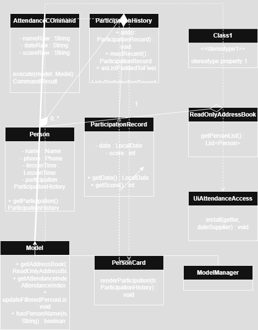

# ClassConnect Developer Guide

<!-- * Table of Contents -->
<page-nav-print />

--------------------------------------------------------------------------------------------------------------------

## **Acknowledgements**

This project builds upon the [se-edu AddressBook Level 3](https://se-education.org/addressbook-level3) codebase created by the [SE-EDU initiative](https://se-education.org) and adapts it for the NUS CS2103T team project.

--------------------------------------------------------------------------------------------------------------------
## **Setting up, getting started**

Refer to the guide [_Setting up and getting started_](SettingUp.md).

--------------------------------------------------------------------------------------------------------------------

## **Design**

### Architecture

<puml src="diagrams/ArchitectureDiagram.puml" width="280" />

The ***Architecture Diagram*** given above explains the high-level design of the App.

Given below is a quick overview of main components and how they interact with each other.

**Main components of the architecture**

**`Main`** (consisting of classes [`Main`](https://github.com/se-edu/addressbook-level3/tree/master/src/main/java/seedu/address/Main.java) and [`MainApp`](https://github.com/se-edu/addressbook-level3/tree/master/src/main/java/seedu/address/MainApp.java)) is in charge of the app launch and shut down.
* At app launch, it initializes the other components in the correct sequence, and connects them up with each other.
* At shut down, it shuts down the other components and invokes cleanup methods where necessary.

The bulk of the app's work is done by the following four components:

* [**`UI`**](#ui-component): The UI of the App.
* [**`Logic`**](#logic-component): The command executor.
* [**`Model`**](#model-component): Holds the data of the App in memory.
* [**`Storage`**](#storage-component): Reads data from, and writes data to, the hard disk.

[**`Commons`**](#common-classes) represents a collection of classes used by multiple other components.

**How the architecture components interact with each other**

The *Sequence Diagram* below shows how the components interact with each other for the scenario where the user issues the command `delete-student i/1`.

<puml src="diagrams/ArchitectureSequenceDiagram.puml" width="574" />

Each of the four main components (also shown in the diagram above),

* defines its *API* in an `interface` with the same name as the Component.
* implements its functionality using a concrete `{Component Name}Manager` class (which follows the corresponding API `interface` mentioned in the previous point.

For example, the `Logic` component defines its API in the `Logic.java` interface and implements its functionality using the `LogicManager.java` class which follows the `Logic` interface. Other components interact with a given component through its interface rather than the concrete class (reason: to prevent outside component's being coupled to the implementation of a component), as illustrated in the (partial) class diagram below.

<puml src="diagrams/ComponentManagers.puml" width="300" />

The sections below give more details of each component.

### UI component

The **API** of this component is specified in [`Ui.java`](https://github.com/se-edu/addressbook-level3/tree/master/src/main/java/seedu/address/ui/Ui.java)

<puml src="diagrams/UiClassDiagram.puml" alt="Structure of the UI Component"/>

The UI consists of a `MainWindow` that is made up of parts e.g.`CommandBox`, `ResultDisplay`, `PersonListPanel`, `StatusBarFooter` etc. All these, including the `MainWindow`, inherit from the abstract `UiPart` class which captures the commonalities between classes that represent parts of the visible GUI.

The `UI` component uses the JavaFx UI framework. The layout of these UI parts are defined in matching `.fxml` files that are in the `src/main/resources/view` folder. For example, the layout of the [`MainWindow`](https://github.com/se-edu/addressbook-level3/tree/master/src/main/java/seedu/address/ui/MainWindow.java) is specified in [`MainWindow.fxml`](https://github.com/se-edu/addressbook-level3/tree/master/src/main/resources/view/MainWindow.fxml)

The `UI` component,

* executes user commands using the `Logic` component.
* listens for changes to `Model` data so that the UI can be updated with the modified data.
* keeps a reference to the `Logic` component, because the `UI` relies on the `Logic` to execute commands.
* depends on some classes in the `Model` component, as it displays `Person` object residing in the `Model`.

### Logic component

**API** : [`Logic.java`](https://github.com/se-edu/addressbook-level3/tree/master/src/main/java/seedu/address/logic/Logic.java)

Here's a (partial) class diagram of the `Logic` component:

<puml src="diagrams/LogicClassDiagram.puml" width="550"/>

The sequence diagram below illustrates the interactions within the `Logic` component, taking `execute("delete-student i/1")` API call as an example.

<puml src="diagrams/DeleteSequenceDiagram.puml" alt="Interactions Inside the Logic Component for the `delete-student i/1` Command" />

<box type="info" seamless>

**Note:** The lifeline for `DeleteCommandParser` should end at the destroy marker (X) but due to a limitation of PlantUML, the lifeline continues till the end of diagram.
</box>

How the `Logic` component works:

1. When `Logic` is called upon to execute a command, it is passed to an `AddressBookParser` object which in turn creates a parser that matches the command (e.g., `DeleteCommandParser`) and uses it to parse the command.
1. This results in a `Command` object (more precisely, an object of one of its subclasses e.g., `DeleteCommand`) which is executed by the `LogicManager`.
1. The command can communicate with the `Model` when it is executed (e.g. to delete a person).<br>
   Note that although this is shown as a single step in the diagram above (for simplicity), in the code it can take several interactions (between the command object and the `Model`) to achieve.
1. The result of the command execution is encapsulated as a `CommandResult` object which is returned back from `Logic`.

Here are the other classes in `Logic` (omitted from the class diagram above) that are used for parsing a user command:

<puml src="diagrams/ParserClasses.puml" width="600"/>

How the parsing works:
* When called upon to parse a user command, the `AddressBookParser` class creates an `XYZCommandParser` (`XYZ` is a placeholder for the specific command name e.g., `AddCommandParser`) which uses the other classes shown above to parse the user command and create a `XYZCommand` object (e.g., `AddCommand`) which the `AddressBookParser` returns back as a `Command` object.
* All `XYZCommandParser` classes (e.g., `AddCommandParser`, `DeleteCommandParser`, ...) inherit from the `Parser` interface so that they can be treated similarly where possible e.g, during testing.

### Model component
**API** : [`Model.java`](https://github.com/se-edu/addressbook-level3/tree/master/src/main/java/seedu/address/model/Model.java)

<puml src="diagrams/ModelClassDiagram.puml" width="450" />


The `Model` component,

* stores the address book data i.e., all `Person` objects (which are contained in a `UniquePersonList` object).
* stores the currently 'selected' `Person` objects (e.g., results of a search query) as a separate _filtered_ list which is exposed to outsiders as an unmodifiable `ObservableList<Person>` that can be 'observed' e.g. the UI can be bound to this list so that the UI automatically updates when the data in the list change.
* stores a `UserPref` object that represents the user’s preferences. This is exposed to the outside as a `ReadOnlyUserPref` objects.
* does not depend on any of the other three components (as the `Model` represents data entities of the domain, they should make sense on their own without depending on other components)

<box type="info" seamless>

**Note:** An alternative (arguably, a more OOP) model is given below. It has a `Tag` list in the `AddressBook`, which `Person` references. This allows `AddressBook` to only require one `Tag` object per unique tag, instead of each `Person` needing their own `Tag` objects.<br>

<puml src="diagrams/BetterModelClassDiagram.puml" width="450" />

</box>


### Storage component

**API** : [`Storage.java`](https://github.com/se-edu/addressbook-level3/tree/master/src/main/java/seedu/address/storage/Storage.java)

<puml src="diagrams/StorageClassDiagram.puml" width="550" />

The `Storage` component,
* can save both address book data and user preference data in JSON format, and read them back into corresponding objects.
* inherits from both `AddressBookStorage` and `UserPrefStorage`, which means it can be treated as either one (if only the functionality of only one is needed).
* depends on some classes in the `Model` component (because the `Storage` component's job is to save/retrieve objects that belong to the `Model`)

### Common classes

Classes used by multiple components are in the `seedu.address.commons` package.

--------------------------------------------------------------------------------------------------------------------

## **Implementation**

This section describes some noteworthy details on how certain features are implemented.

### Grouping feature

The grouping feature lets you organize students into named groups and manage memberships with commands such as group-create, group-add, group-remove, and group-delete. This is useful for filtering by group (e.g., “Sec3”, “MorningClass”) and showing group badges on each student card.

Key ideas

* A Group has a GroupName and a set of Person members.

* Commands operate through the Model interface; storage lives in the AddressBook via a UniqueGroupList.

* UI reads memberships via a small bridge (UiGroupAccess) to render badges next to each name.

<puml src="diagrams/Grouping.puml" alt="Class Diagram for Grouping" />

### Attendance / Participation Command (overview)

The participation feature records a per-class score (`s/0..5`) for a student and updates the 5-box history shown on each Person card, with the **class date above** each box and the **score inside**.



### Add student feature

This feature adds a student into the students list. This feature is facilitated by the `LogicManger`, `AddressBookParser`, `AddCommandParser`, `AddCommand`, `CommandResult` and `Model` classes. Given below is a high level overview of how a student is being added into the students list.

<puml src="diagrams/AddSequenceDiagram.puml" width="550" />

### Delete student feature

This features deletes a student form the students list. This feature is facilitated by the `LogicManger`, `AddressBookParser`, `DeleteCommandParser`, `DeleteCommand`, `CommandResult` and `Model` classes. Given below is a high level overview of how a student is being deleted from the students list.

<puml src="diagrams/DeleteSequenceDiagram.puml" width="550" />

### Mark payment feature

The Payment Tracking feature allows tutors to mark and track monthly payment status for each student across a 12-month period. This feature provides both visual indicators in the UI and command-line operations for updating payment records.

Key ideas
* A `Person` stores payment status using a `BitSet` with 12 bits (one for each month).
* Payment status can be marked as paid or unpaid for any month (1-12, representing January to December).
* The command operates through the `Model` interface and updates the `Person` object in-place.
* The UI displays payment status under each student card with color-coded rectangles (green = paid, red = unpaid). 
* Validation prevents marking an already-paid month as paid again or an already-unpaid month as unpaid again.


The diagram above illustrates the **Payment Management** use cases in ClassConnect. Tutors can **mark students as paid or unpaid** for specific months and **view payment status** for all students.

- **Mark Student as Paid**: Updates a student's payment status to paid for a specified month.
- **Mark Student as Unpaid**: Updates a student's payment status to unpaid for a specified month.
- **View Payment Status**: Displays a 12-month payment grid for each student with visual indicators.

Each of these features interacts with the `paymentStatus` field stored within every `Person` object.


### \[Proposed\] Undo/redo feature

#### Proposed Implementation

The proposed undo/redo mechanism is facilitated by `VersionedAddressBook`. It extends `AddressBook` with an undo/redo history, stored internally as an `addressBookStateList` and `currentStatePointer`. Additionally, it implements the following operations:

* `VersionedAddressBook#commit()` — Saves the current address book state in its history.
* `VersionedAddressBook#undo()` — Restores the previous address book state from its history.
* `VersionedAddressBook#redo()` — Restores a previously undone address book state from its history.

These operations are exposed in the `Model` interface as `Model#commitAddressBook()`, `Model#undoAddressBook()` and `Model#redoAddressBook()` respectively.

Given below is an example usage scenario and how the undo/redo mechanism behaves at each step.

Step 1. The user launches the application for the first time. The `VersionedAddressBook` will be initialized with the initial address book state, and the `currentStatePointer` pointing to that single address book state.

<puml src="diagrams/UndoRedoState0.puml" alt="UndoRedoState0" />

Step 2. The user executes `delete 5` command to delete the 5th person in the address book. The `delete` command calls `Model#commitAddressBook()`, causing the modified state of the address book after the `delete 5` command executes to be saved in the `addressBookStateList`, and the `currentStatePointer` is shifted to the newly inserted address book state.

<puml src="diagrams/UndoRedoState1.puml" alt="UndoRedoState1" />

Step 3. The user executes `add n/David …​` to add a new person. The `add` command also calls `Model#commitAddressBook()`, causing another modified address book state to be saved into the `addressBookStateList`.

<puml src="diagrams/UndoRedoState2.puml" alt="UndoRedoState2" />

<box type="info" seamless>

**Note:** If a command fails its execution, it will not call `Model#commitAddressBook()`, so the address book state will not be saved into the `addressBookStateList`.

</box>

Step 4. The user now decides that adding the person was a mistake, and decides to undo that action by executing the `undo` command. The `undo` command will call `Model#undoAddressBook()`, which will shift the `currentStatePointer` once to the left, pointing it to the previous address book state, and restores the address book to that state.

<puml src="diagrams/UndoRedoState3.puml" alt="UndoRedoState3" />


<box type="info" seamless>

**Note:** If the `currentStatePointer` is at index 0, pointing to the initial AddressBook state, then there are no previous AddressBook states to restore. The `undo` command uses `Model#canUndoAddressBook()` to check if this is the case. If so, it will return an error to the user rather
than attempting to perform the undo.

</box>

The following sequence diagram shows how an undo operation goes through the `Logic` component:

<puml src="diagrams/UndoSequenceDiagram-Logic.puml" alt="UndoSequenceDiagram-Logic" />

<box type="info" seamless>

**Note:** The lifeline for `UndoCommand` should end at the destroy marker (X) but due to a limitation of PlantUML, the lifeline reaches the end of diagram.

</box>

Similarly, how an undo operation goes through the `Model` component is shown below:

<puml src="diagrams/UndoSequenceDiagram-Model.puml" alt="UndoSequenceDiagram-Model" />

The `redo` command does the opposite — it calls `Model#redoAddressBook()`, which shifts the `currentStatePointer` once to the right, pointing to the previously undone state, and restores the address book to that state.

<box type="info" seamless>

**Note:** If the `currentStatePointer` is at index `addressBookStateList.size() - 1`, pointing to the latest address book state, then there are no undone AddressBook states to restore. The `redo` command uses `Model#canRedoAddressBook()` to check if this is the case. If so, it will return an error to the user rather than attempting to perform the redo.

</box>

Step 5. The user then decides to execute the command `list`. Commands that do not modify the address book, such as `list`, will usually not call `Model#commitAddressBook()`, `Model#undoAddressBook()` or `Model#redoAddressBook()`. Thus, the `addressBookStateList` remains unchanged.

<puml src="diagrams/UndoRedoState4.puml" alt="UndoRedoState4" />

Step 6. The user executes `clear`, which calls `Model#commitAddressBook()`. Since the `currentStatePointer` is not pointing at the end of the `addressBookStateList`, all address book states after the `currentStatePointer` will be purged. Reason: It no longer makes sense to redo the `add n/David …​` command. This is the behavior that most modern desktop applications follow.

<puml src="diagrams/UndoRedoState5.puml" alt="UndoRedoState5" />

The following activity diagram summarizes what happens when a user executes a new command:

<puml src="diagrams/CommitActivityDiagram.puml" width="250" />

#### Design considerations:

**Aspect: How undo & redo executes:**

* **Alternative 1 (current choice):** Saves the entire address book.
  * Pros: Easy to implement.
  * Cons: May have performance issues in terms of memory usage.

* **Alternative 2:** Individual command knows how to undo/redo by
  itself.
  * Pros: Will use less memory (e.g. for `delete`, just save the person being deleted).
  * Cons: We must ensure that the implementation of each individual command are correct.

_{more aspects and alternatives to be added}_

### \[Proposed\] Data archiving

_{Explain here how the data archiving feature will be implemented}_


--------------------------------------------------------------------------------------------------------------------

## **Documentation, logging, testing, configuration, dev-ops**

* [Documentation guide](Documentation.md)
* [Testing guide](Testing.md)
* [Logging guide](Logging.md)
* [Configuration guide](Configuration.md)
* [DevOps guide](DevOps.md)

--------------------------------------------------------------------------------------------------------------------

## Appendix: Requirements

### Product scope

**Target user profile**:
- Private tutors managing ~20–40 students individually.
- Need to keep track of **student + parent contact details, lesson times, homework, payments, and performance notes**.
- Prefer **fast, keyboard-driven CLI apps** over complex GUIs.
- Comfortable with basic computer operations, but want **lightweight, no-frills software**.

**Value proposition**: ClassConnect allows tutors to manage lessons, admin tasks, and student progress **faster and more accurately** than traditional notebooks or bloated management systems.

---

### User stories

Priorities: High (must have) - `* * *`, Medium (nice to have) - `* *`, Low (unlikely to have) - `*`

| Priority | As a …​  | I want to …​                                | So that I can…​                                   |
|----------|----------|----------------------------------------------|---------------------------------------------------|
| `* * *`  | tutor    | add a student                               | start tracking their details and progress         |
| `* * *`  | tutor    | delete a student                            | remove those who have stopped lessons             |
| `* * *`  | tutor    | record homework with deadlines              | remind students and follow up on time             |
| `* * *`  | tutor    | record tuition payments                     | know which students have overdue fees             |
| `* * *`  | tutor    | store parent contacts                       | reach guardians quickly                           |
| `* *`    | tutor    | archive old students                        | keep my active list uncluttered                   |
| `* *`    | tutor    | filter/search students by subject/level     | quickly find relevant students                    |
| `*`      | tutor    | export data into a report                   | share with parents or keep records offline        |
| `*`      | tutor    | set exam reminders                          | notify me ahead of students’ important dates      |

---

### Use cases

(For all use cases below, the **System** is `ClassConnect` and the **Actor** is the `tutor`)

**Use case 1: Add Student**

**MSS**
1. Tutor enters `add-student n/Marcus p/98765432 t/Mon 1900 lvl/Sec3 sub/Math`.
2. System validates the input.
3. System stores the student record.
4. System confirms addition.

**Extensions**
- 2a. Input is invalid (e.g., wrong phone format).
  → System shows error and requests re-entry.

---

**Use case 2: Record Homework**

**MSS**
1. Tutor enters `add-homework sid/1 d/Finish Ch.3 problems due/2025-10-05`.
2. System validates and links homework to student.
3. System confirms creation.

**Extensions**
- 2a. Student ID not found.
  → System shows error and suggests checking student list.

---

**Use case 7: Mark Student as Paid**

**MSS**

1. Tutor enters `mark-paid i/1 m/1`.
2. System validates the input.
3. System marks the specified month as paid for the student.
4. System displays success message:
```
Marked student as paid: marcus ng
Month: January
Payment Status: 
Jan: ✓ Paid Feb: ✗ Paid Mar: ✗ Unpaid Apr: ✗ Unpaid May: ✗ Unpaid Jun: ✗ Unpaid
Jul: ✗ Unpaid Aug: ✗ Unpaid Sep: ✗ Unpaid Oct: ✗ Unpaid Nov: ✗ Unpaid Dec: ✗ Unpaid
```

**Extensions**

- 2a. Input is invalid (e.g., missing or wrong prefixes).
  - 2a1. System shows error message: "Invalid command format! mark-paid: Marks a student as paid for a month..."
  - Use case ends.

- 2b. Student index is out of range.
  - 2b1. System displays "Invalid student index provided."
  - Use case ends.

- 2c. Month is invalid (not between 1 and 12).
  - 2c1. System displays "Invalid month. Month must be between 1 and 12."
  - Use case ends.

- 2d. Student is already marked as paid for that month.
  - 2d1. System displays "Student marcus ng is already marked as paid for January."
  - Use case ends.

---

**Use case 8: Mark Student as Unpaid**

**MSS**

1. Tutor enters `mark-unpaid i/1 m/1`.
2. System validates the input.
3. System marks the specified month as unpaid for the student.
4. System displays success message:
```
Marked student as unpaid: marcus ng
Month: January
Payment Status: 
Jan: ✗ Unpaid Feb: ✓ Paid Mar: ✓ Paid Apr: ✓ Paid May: ✓ Paid Jun: ✓ Paid
Jul: ✓ Paid Aug: ✓ Paid Sep: ✓ Paid Oct: ✓ Paid Nov: ✓ Paid Dec: ✓ Paid
```

**Extensions**

- 2a. Input is invalid (e.g., missing or wrong prefixes).
  - 2a1. System shows error message: "Invalid command format! mark-unpaid: Marks a student as unpaid for a month..."
  - Use case ends.

- 2b. Student index is out of range.
  - 2b1. System displays "Invalid student index provided."
  - Use case ends.

- 2c. Month is invalid (not between 1 and 12).
  - 2c1. System displays "Invalid month. Month must be between 1 and 12."
  - Use case ends.

- 2d. Student is already marked as unpaid for that month.
  - 2d1. System displays "Student marcus ng is already marked as unpaid for January."
  - Use case ends.

---

**Use case 9: View Payment Status**

**MSS**

1. Tutor views the student list in the UI.
2. System displays payment status for each student with a 12-month visual grid.
3. Tutor can quickly identify which students have unpaid months (red rectangles).

**Extensions**

- 2a. No students in the list.
  - 2a1. System displays empty list.
  - Use case ends.

---

### Non-Functional Requirements
1. **Setup**
- Should work on any mainstream OS as long as it has Java 17 or above installed.

2. **Performance**
- The application should launch and load stored data within 2 seconds of starting up
- The search method should return results within 300ms per 10000 student records
- All valid commands should complete execution and display feedback in less than 300ms

3. **Scalability**
- Able to scale up to 10000 students without any significant decrease in performance
- Data structures should be implemented in a way such that adding more students minimally affects search and
delete methods

4. **Usability**
- Every command entered will print out either a success message or a specific error message
- Help command will print out clear list of commands with their respective usage examples
- A user with above average typing speed for regular English text should be able to accomplish most of the tasks faster
using commands than using the mouse.

5. **Maintainability**
- The codebase should follow OOP principles
- Test coverage should cover most if not all of the methods and classes
- Error messages and command validation logic should be centralized to avoid inconsistency across commands.

---

### Glossary

- **CLI (Command-Line Interface)**: Text-based input system for commands.
- **Student Profile**: A record including name, contact, parent contact, level, subject, lesson time, homework, payments, and notes.
- **Archive**: To remove a student from the active list while retaining their records for later recovery.
- **Overdue fees**: Payments recorded but not marked as paid after the due date.
- **Mainstream OS**: Windows, Linux, MacOS with Java 17+.
- **Feedback**:  Either an error message or command successfully executed message
- **Centralised** : Defined in one single place within the codebase

## Appendix: Instructions
### Payment Feature

#### Marking as paid

1. Marks a student has paid for a month

1. Prerequisites:
   - Ensure at least one student (e.g., Marcus) is in the list using `list`.
   - The student has not paid for the intended month.

1. Test case:  
   `mark-paid i/1 m/1`  
   Expected: Payment has been marked for Marcus in the month of January. Success message shown:  
   `Marked student as paid: marcus ng
Month: January
Payment Status:
Jan: ✓ Paid
Feb: ✓ Paid
Mar: ✓ Paid
Apr: ✓ Paid
May: ✓ Paid
Jun: ✓ Paid
Jul: ✓ Paid
Aug: ✓ Paid
Sep: ✓ Paid
Oct: ✓ Paid
Nov: ✓ Paid
Dec: ✓ Paid`

1. Test case:
   `mark-paid i/999 m/1` (invalid id)
   Expected: Error message displayed:  
   `Invalid student index provided.`

1. Test case:  
   `mark-paid i/1 m/13` (invalid month)
   Expected: Error message displayed:  
   `Month must be a valid number between 1 and 12`

1. Test case:  
   `mark-paid i/1 m/1` (student has paid for January)  
   Expected: Error message displayed:  
   `Student marcus ng is already marked as paid for January.`

---

#### Marking as unpaid

1. Marks a student has not paid for a month

1. Prerequisites:
   - At least one student (e.g., Marcus) is in the list using `list`.
   - The student has been marked as paid for the intended month.
   - The tutor intends to change the status to unpaid for the intended month.

1. Test case:  
   `mark-unpaid i/1 m/1`  
   Expected: Payment has been unmarked for Marcus in the month of January. Success message shown:  
   `Marked student as unpaid: marcus ng
Month: January
Payment Status:
Jan: ✗ Unpaid
Feb: ✓ Paid
Mar: ✓ Paid
Apr: ✓ Paid
May: ✓ Paid
Jun: ✓ Paid
Jul: ✓ Paid
Aug: ✓ Paid
Sep: ✓ Paid
Oct: ✓ Paid
Nov: ✓ Paid
Dec: ✓ Paid`

1. Test case:
   `mark-paid i/999 m/1` (invalid id)
   Expected: Error message displayed:  
   `Invalid student index provided.`

1. Test case:  
   `mark-paid i/1 m/13` (invalid month)
   Expected: Error message displayed:  
   `Month must be a valid number between 1 and 12`

1. Test case:  
   `mark-paid i/1 m/1` (student has paid for January)  
   Expected: Error message displayed:  
   `Student marcus ng is already marked as unpaid for January.`

---

## Appendix: Effort


### Min-Ren Seah (miinren)
I was primarily responsible for updating the delete feature and implementing the payment tracking system.

- **Delete Feature**
    - Implemented the `delete-student` command that allows tutors to delete students by name, subject, or level.

- **Payment Tracker**
    - Designed and implemented all payment related commands:
        - `mark-paid` — to mark a month as paid for a student.
        - `mark-unpaid` and `mark-undone` — to mark a month as unpaid for a student.
    - Extended the `Person` and `AddressBook` models to include the payment system using a `bitset` and handled data persistence through JSON storage.
    - Updated the UI (`PersonCard`) to display payment details with the month using colour coded boxes.
    - Created `JsonAdaptedPerson` for saving of payment data 

## Appendix: Planned Enhancements


