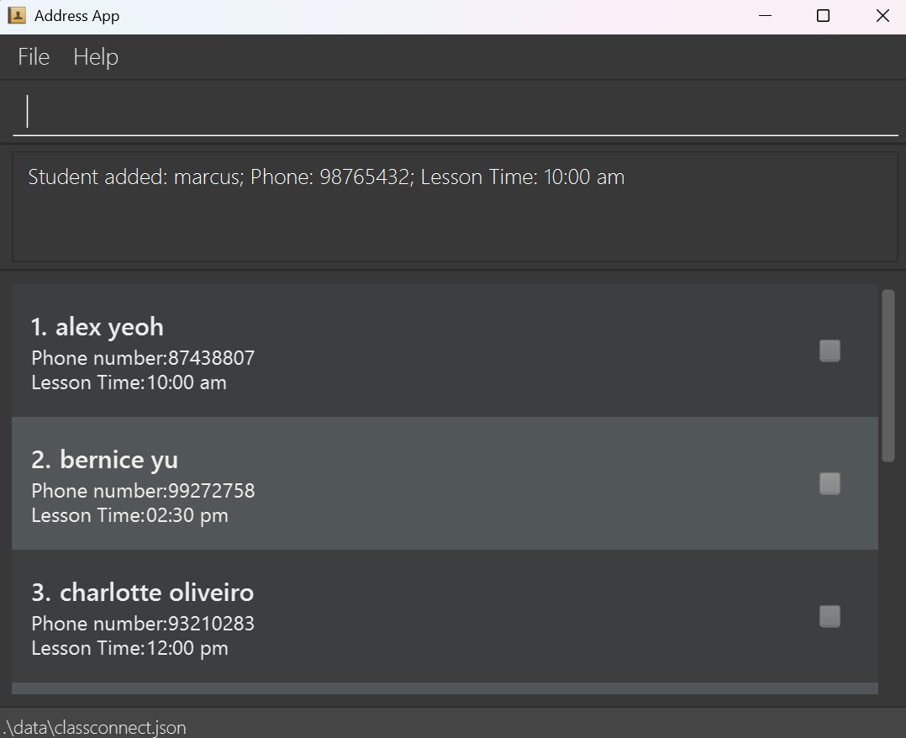

# ClassConnect User Guide

ClassConnect is a **desktop app for managing students' profile, optimized for use via a Command Line Interface** (CLI) while still having the benefits of a Graphical User Interface (GUI). If you can type fast, ClassConnect can get your student management tasks done faster than traditional GUI apps.

--------------------------------------------------------------------------------------------------------------------

## Quick start

1. Ensure you have Java `17` or above installed in your Computer. 
   **Mac users:** Ensure you have the precise JDK version prescribed [here](https://se-education.org/guides/tutorials/javaInstallationMac.html).

1. Download the latest `.jar` file from [here](https://github.com/AY2526S1-CS2103T-F12-2/tp/releases).

1. Copy the file to the folder you want to use as the _home folder_ for your AddressBook.

1. Open a command terminal, `cd` into the folder you put the jar file in, and use the `java -jar classconnect.jar` command to run the application. 
   A GUI similar to the below should appear in a few seconds. Note how the app contains some sample data. 
   

1. Type the command in the command box and press Enter to execute it. e.g. typing **`help`** and pressing Enter will open the help window. 
   Some example commands you can try:

   * `list` : Lists all students.

   * `add-student n/John Doe p/98765432 t/1000` : Adds a student named `John Doe` to the student list.

   * `delete-student i/3` : Deletes the 3rd student shown in the current list.

   * `clear` : Deletes all students.

   * `exit` : Exits the app.

1. Refer to the [Features](#features) below for details of each command.

--------------------------------------------------------------------------------------------------------------------

## Features

<box type="info" seamless>

**Notes about the command format:** 

* Words in `UPPER_CASE` are the parameters to be supplied by the user. e.g. in `add-student n/NAME`, `NAME` is a parameter which can be used as `add-student n/John Doe`.

* Items in square brackets are optional. e.g. `n/NAME [t/LESSON_TIME]` can be used as `n/John Doe t/1000` or as `n/John Doe`.

* Parameters can be in any order. e.g. if the command specifies `n/NAME p/PHONE_NUMBER`, `p/PHONE_NUMBER n/NAME` is also acceptable.

* Extraneous parameters for commands that do not take in parameters (such as `help`, `list`, `exit` and `clear`) will be ignored. e.g. if the command specifies `help 123`, it will be interpreted as `help`.

* If you are using a PDF version of this document, be careful when copying and pasting commands that span multiple lines as space characters surrounding line-breaks may be omitted when copied over to the application.

</box>

### Viewing help : `help`

Shows a message explaining how to access the help page.

Format: `help`

### Adding a student: `add-student`

Adds a student to the student list.

Format: `add-student n/NAME p/PHONE_NUMBER t/LESSON_TIME...`

* `NAME` should not be blank and should only **contain letters, spaces, hyphens, apostrophes, with a maximum length of 50 characters**. It is also case-insensitive. e.g. `john doe` is the same as `John Doe`.
* `PHONE_NUMBER` should only contain numbers, and should be **8 digits long starting with 8 or 9**.
* `LESSON_TIME` should be in **24-hour format** without a colon, followed by a 3-letter day abbreviation.
  e.g. `0900 Sun` for 9am Sunday, `1530 Thu` for 3:30pm Thursday. The time should be between `0000` and `2359`.

Examples:
* `add-student n/John Doe p/98765432 t/1000 Wed` Adds a student named `John Doe`, with phone number `98765432` and lesson time `10:00 am Wed`.
* `add-student t/1330 Fri p/81234567 n/Betsy Crowe t/1100 Sat` Adds a student named `Betsy Crowe`, with phone number `81234567` and lesson times `01:30 pm Fri`, `11:00 am Sat`.

### Listing all students : `list`

Shows a list of all students in the student list.

Format: `list`

### Editing a student : `edit-student`

Edits an existing student in the student list.

Format: `edit-student i/INDEX [n/NAME] [p/PHONE] [t/LESSON_TIME]...`

* Edits the student at the specified `INDEX`. The index refers to the index number shown in the displayed student list. The index **must be a positive integer** 1, 2, 3, …​
* At least one of the optional fields must be provided.
* Existing values will be updated to the input values.
* If one of the lesson times is to be updated, all other unchanged lesson times must also be provided.

Examples:
*  `edit-student i/1 p/91234567` Edits the phone number of the 1st student to be `91234567`.
*  `edit-student i/2 n/Betsy Crower t/0930 Tue` Edits the name of the 2nd student to be `Betsy Crower` and lesson time to be `09:30 am Tue`.

### Locating students: `search-student`

Finds persons whose names contain any of the given keywords.

Format: `search-student k/KEYWORD [MORE_KEYWORDS]`

* The search is case-insensitive. e.g. `marcus` will match `Marcus`
* The order of the keywords does not matter. e.g. `Marcus Ng` will match `Ng Marcus`
* Names, phone numbers and lesson times are searched.
* Partial matches within a word is supported. e.g. `Mar` will match `Marcus`
* Students matching at least one keyword will be returned (i.e. `OR` search).
  e.g. `Marcus 9876` will return `Marcus Ng (9876 1111)`, `John Tan (9876 5432)`

Examples:
* `search-student k/marcus` Returns `Marcus Ng` and `Marcus Tan`.
* `search-student k/9876` Returns all students whose phone number contains 9876.
* `search-student k/10:00` Returns all students with lesson time 10:00.

### Deleting a student : `delete-student`

Deletes the specified student from the address book.

Format: `delete-student i/INDEX`

* Deletes the student at the specified `INDEX`.
* The index refers to the index number shown in the displayed student list.
* The index **must be a positive integer** 1, 2, 3, …​
* The list cannot be empty.

Examples:
* `list` followed by `delete i/2` deletes the 2nd person in the address book.
* `search-student k/Marcus` followed by `delete i/1` deletes the 1st person in the results of the `search-student` command.

### Recording attendance : `attendance`

Records a student’s attendance for a specific date.

Format: `attendance n/NAME d/YYYY-MM-DD s/1|0`
* `NAME` is the name of the student whose attendance is to be recorded. It is case-insensitive. e.g. `marcus` is the same as `Marcus`.
* `DATE` should be in the format `YYYY-MM-DD`. e.g. `2025-09-19` for 19th September 2025.
* `STATUS` should be either `1` (for Present) or `0` (for Absent).
* If attendance for the same student and date is already recorded with the same status, the command is rejected as redundant. e.g. “Student marcus is already marked as Present on 2025-09-19.”
* If attendance exists but the status is different, the new status is recorded (updates the entry).

Examples:
* `attendance n/marcus d/2025-09-19 s/1` Marks student `marcus` as Present on 19th September 2025.
→ Success: Attendance recorded: marcus, 2025-09-19, Present.

Note:

* Attendance is tracked in-memory alongside the address book.
* Using clear resets the address book and clears all attendance records

### Clearing all entries : `clear`

Clears all entries from the student list.

Format: `clear`

### Exiting the program : `exit`

Exits the program.

Format: `exit`

### Saving the data

ClassConnect data are saved in the hard disk automatically after any command that changes the data. There is no need to save manually.

### Editing the data file

ClassConnect data are saved automatically as a JSON file `[JAR file location]/data/classconnect.json`. Advanced users are welcome to update data directly by editing that data file.

<box type="warning" seamless>

**Caution:**
If your changes to the data file makes its format invalid, ClassConnect will discard all data and start with an empty data file at the next run.  Hence, it is recommended to take a backup of the file before editing it. 
Furthermore, certain edits can cause the ClassConnect to behave in unexpected ways (e.g., if a value entered is outside the acceptable range). Therefore, edit the data file only if you are confident that you can update it correctly.

</box>

### Archiving data files `[coming in v2.0]`

_Details coming soon ..._

--------------------------------------------------------------------------------------------------------------------

## FAQ

**Q**: How do I transfer my data to another Computer? 
**A**: Install the app in the other computer and overwrite the empty data file it creates with the file that contains the data of your previous ClassConnect home folder.

--------------------------------------------------------------------------------------------------------------------

## Known issues

1. **When using multiple screens**, if you move the application to a secondary screen, and later switch to using only the primary screen, the GUI will open off-screen. The remedy is to delete the `preferences.json` file created by the application before running the application again.
2. **If you minimize the Help Window** and then run the `help` command (or use the `Help` menu, or the keyboard shortcut `F1`) again, the original Help Window will remain minimized, and no new Help Window will appear. The remedy is to manually restore the minimized Help Window.

--------------------------------------------------------------------------------------------------------------------

## Command summary

Action     | Format, Examples
-----------|----------------------------------------------------------------------------------------------------------------------------------------------------------------------
**Add**    | `add-student n/NAME p/PHONE_NUMBER t/LESSON_TIME...`   e.g., `add-student n/James Ho p/98765432 t/1000 Mon t/1400 Wed`
**Attendance**    | `attendance n/NAME d/DATE s/STATUS`   e.g., `attendance n/James Ho d/2025-09-19 s/1`
**Clear**  | `clear`
**Delete** | `delete-student i/INDEX`  e.g., `delete-student i/3`
**Edit**   | `edit-student i/INDEX [n/NAME] [p/PHONE_NUMBER] [t/LESSON_TIME]...`  e.g.,`edit-student i/2 n/James Lee t/1830 Fri t/1000 Sun`
**Search**   | `search-student k/KEYWORD [MORE_KEYWORDS]`   e.g., `search-student k/marcus lee`
**List**   | `list`
**Help**   | `help`
